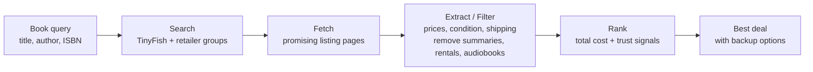

# bookdeal

Find the cheapest good option for a book or ebook using TinyFish Search and Fetch.

BookDeal searches live marketplace pages, fetches promising listings, extracts prices/conditions/shipping signals, filters suspicious results like audiobooks and summaries, then ranks the cheapest reasonable totals.

## Workflow



## Setup

Add your TinyFish key to `.env`:

```bash
TINYFISH_API_KEY="your_api_key_here"
```

Install dependencies:

```bash
pip install -r requirements.txt
```

Or install the project in editable mode:

```bash
pip install -e .
```

Agent mode also needs model credentials:

```bash
GEMINI_API_KEY="your_gemini_key_here"
BOOKDEAL_MODEL="google-gla:gemini-2.5-flash"
```

## Usage

```bash
./bookdeal "Atomic Habits"
./bookdeal "The Hobbit" --author "J.R.R. Tolkien" --year 1937
./bookdeal "The Hobbit" --isbn 9780547928227
./bookdeal "Atomic Habits" --stats
./bookdeal "All the Light We Cannot See" --json
./bookdeal "Atomic Habits" --warnings
```

The positional argument is the title. Use `--author`, `--year`, `--isbn`, or `--edition` when you want a more specific search without treating those details as part of the exact title phrase.

Fetch warnings are hidden by default for cleaner CLI output. Pass `--warnings` when you want to see TinyFish fetch failures for debugging.

For the full option reference, including format filters, benchmarks, rate limits, and agent mode, see [OPTIONS.md](OPTIONS.md).

## Performance Testing

Run the deterministic benchmark:

```bash
python3 test/performance_test.py --limit 100
```

Run the agent benchmark:

```bash
python3 test/agent_performance_test.py --limit 3
```

The performance runner uses `test/test_100_details.txt` by default when present. That file includes 100 rows with title, author, year, and optional ISBN/edition fields. Benchmark runs are paced for the TinyFish free tier by default: 30 Search requests/minute and 150 Fetch URLs/minute.

## Current Metrics

From a 100-book deterministic benchmark using `test/test_100_details.txt`:

- Success rate: 91% (91/100)
- Average runtime: 21.25 seconds/query
- Median runtime: 14.86 seconds/query
- Average candidates extracted: 23.66 listings/query
- Average misleading listings filtered: 1.4/query
- Average valid listings ranked: 2.45/query
- Observed cheaper alternatives found: 19/100
- Average savings among cheaper alternatives: $8.11
- Best observed example: `Zero to One` saved $23.71 vs Books-A-Million

BookDeal supports 10+ marketplaces. Individual runs may query fewer marketplaces because the pipeline stops early once it has enough valid results.

## Agent Mode

```bash
./bookdeal "Atomic Habits" --agent
./bookdeal "The Hobbit" --agent --author "J.R.R. Tolkien"
```

The agent can decide to search retailer groups, fetch promising pages, rank extracted candidates, and retry with a broader strategy when the first pass is weak. The deterministic CLI path remains available without `--agent`.

## Ranking

`bookdeal` favors the cheapest valid total, not the raw lowest sticker price. The score includes item price, shipping when found, condition, merchant trust, and suspicious listing penalties.

Listings with terms like `audiobook`, `summary`, `study guide`, `pdf`, or `rental` are filtered out before choosing the best deal. Ebook and Kindle listings are allowed and do not receive a missing-shipping penalty.

## License

BookDeal is open source under the [MIT License](LICENSE).
